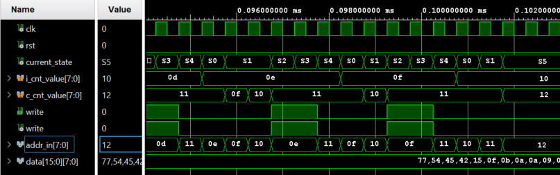
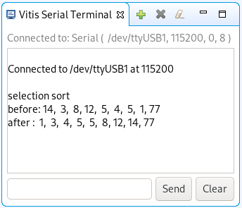
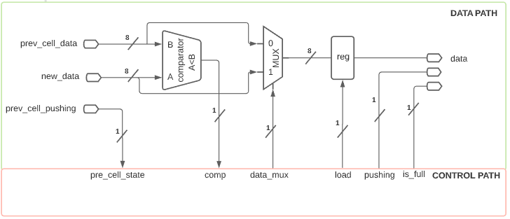
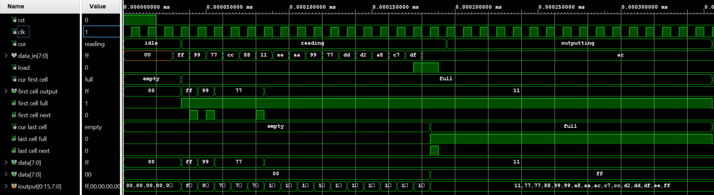
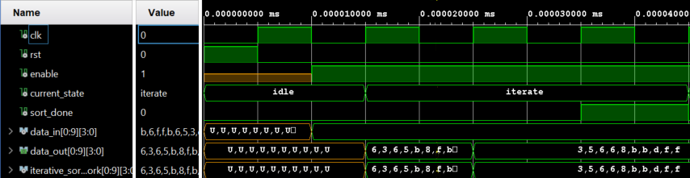
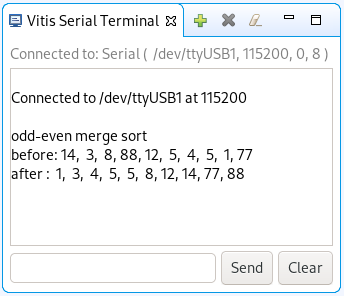
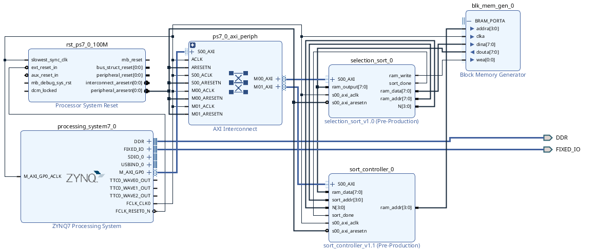

---
title: An Exploration of Array Sorting in Hardware and Software
author:
	- Anders Mæhlum Halvorsen
	- Rahmat Mozafari
	- Ole Martin Ruud
	- Øzlem Tuzkaya
institute: University of South-Eastern Norway
date: 21.09.2020
lang: en-US
bibliography: paper.bib
keywords:
	- fgpa
	- array
	- sorting
abstract: |
	We explored and implemented three different sorting algorithms as software (single-thread C programs) and hardware (VHDL) implementations in FPGAs. Furthermore, we compared the different implementations with regards to efficiency, performance, flexibility, resource usage and code complexity, while particular contrasting hardware and software trade-offs. We found that concurrent sorting algorithms can be parallelized in hardware to achieve higher performance, however hardware implementations require more development effort, have more code complexity and also require more hardware resources. Hence there is a trade-off to be made between multiplexing the algorithm in time or in space, depending on the context of the application.
...

\listoflistings

# Introduction

The level of concurrency varies among array sorting algorithms. In some cases it is low, e.g. selection sorting, but in other cases, it is higher, e.g. odd-even sorting. As Vasquez' shows in his Hackaday article [@vasquez16], we can utilize field-programmable gate arrays (FPGAs) as a platform to implement parallelized versions of concurrent sorting algorithms. Further Skliarova [@skliarova2015] shows an example of implementing a concurrent sorting network on an FPGA. In both cases, one can take advantage of the parallel nature of hardware to increase the performance of the algorithms.

Depending on the context of the application, choosing the algorithm and its implementation with care can be crucial to fulfil the given requirements. Different algorithms and implementations can have widely different properties when it comes to performance, efficiency, flexibility, resource usage and code complexity. Understanding these trade-offs is valuable to develop highly effective and well-engineered applications.

We will explore and implement three different sorting algorithms as software (single-thread C programs) and hardware (VHDL) implementations in FPGAs. Furthermore, we will compare the different implementations with regards to efficiency, performance, flexibility, resource usage and code complexity; in particular contrasting hardware and software trade-offs.

# Methods

The tools used in this paper was Vivado 2020.1, Vitis 2020.1 and the Zybo Zynq-7000 board [@zybozynq7000]. We used Vivado for the hardware implementations and we programmed the Zynq-7000 board. For the software and IP implementation, we used the Vitis IDE, where we also used the Zynq-7000 board for testing.

For all of our algorithms, we followed the same steps. We started by creating a finite-state machine with datapath (FSMD) architecture of the overall algorithm we were currently building; we did this to get an overview of what components and signals were needed. Based on the FSMD architecture created, we designed the algorithmic state machine with datapath (ASMD) chart. This was done to easily convert the chart into code when implementing the algorithm, while also having a good overview of the states needed.

After finishing making all of the necessary charts, we then started to implement the sorting algorithm in Vivado. To make the code as reusable as possible, we created an individual file for each of our components. We also made the last two algorithms generic, such that the amount of inputs and sizes could be easily adjusted by the user.

To confirm that our sorting algorithms worked as expected, we created a test bench and analysed the outputs.

The software implementation, in contrast to the hardware implementation, was a much more straight forward process. Firstly, we created a generic block diagram with the Zynq processor unit in Vivado. Then after uploading it to Vitis, we simply connect the Zybo board to the computer and started running the software code. For testing, we used the built-in Vitis serial console.

For our first algorithm, we made an effort to create an IP block. This turned out to be an immensely time-consuming process due to a lot of troubleshooting. Seeing that the implementation of the IP would not have had a significant impact on our vision or result for our paper, we chose to exclude it from consideration. However we left the results for the particularly interested in @sec:ip-implementation-appendix.

# Results

In this section, we are going to presenting the results we gathered through to applying our methods. Firstly we will give a quick overview comparable results from Vivado, and then we will go into each algorithm and the corresponding software and hardware implementations.

## Overview of implementations

The different implementations were synthesized and simulated using Vivado 2020.1. The most of the results here were gathered through the Vivado interface using the provided analysis tools.

In @tbl:lines-of-code we can see the overview of the number of files and lines of code for each implementation. The number of lines can be an indicator of complexity, but it must be used carefully as code can, of course, be optimized for size. In our case, we have tried to follow a consistent formatting style in addition to not optimizing for size. Another important note is that we are only counting lines of code, not comments or blank lines, and also only code which is part of the implementation of the algorithm, so no test benches or code for displaying arrays etc.

| Implementation                 | Files | Lines |
|--------------------------------|------:|------:|
| Selection sort (hardware)      |     7 |   270 |
| Linear cell sort (hardware)    |     8 |   360 |
| Odd-even sort (hardware)       |     4 |   216 |
|                                |       |       |
| Selection sort (software)      |     1 |    14 |
| Linear cell sort (software)    |     1 |    21 |
| Odd-even merge sort (software) |     1 |    40 |

: Amount of source code for each implementation \label{tbl:lines-of-code}

In @tbl:hardware-utilization and @fig:hardware-utilization we can see the usage of hardware resources for each algorithm across multiple input sizes. This was done to enable us to see the increase in hardware resources as the amount of signals to be sorted was increased. It's worth noting that each measurement was done with a data size of $8$ bytes. Further in @fig:hardware-power we can see the on-chip power usage of each implementation.

\pagebreak[4]

| Implementation   | Input size | Cells | IO-ports | Nets |  LUT |  FF |
|------------------|-----------:|------:|---------:|-----:|-----:|----:|
| Selection sort   |          4 |    10 |       15 |   51 |   18 |  25 |
|                  |          8 |    10 |       27 |   87 |   37 |  45 |
|                  |         16 |    10 |       51 |  159 |   72 |  85 |
|                  |            |       |          |      |      |     |
| Linear cell sort |          4 |     9 |       12 |   46 |   41 |  27 |
|                  |          8 |    13 |       20 |  112 |  119 |  81 |
|                  |         16 |    21 |       36 |  338 |  404 | 283 |
|                  |            |       |          |      |      |     |
| Odd-even sort    |          4 |    25 |       37 |  120 |   86 |  17 |
| (N layers)       |          8 |    81 |      133 |  712 |  860 |  65 |
|                  |         16 |   289 |      517 | 4872 | 6744 | 258 |
|                  |            |       |          |      |      |     |
| Odd-even sort    |          4 |    24 |       37 |  104 |   78 |  17 |
| (3 layers)       |          8 |    76 |      133 |  392 |  431 |  65 |
|                  |         16 |   276 |      517 | 1544 | 1583 | 257 |

: Overview of cells, IO-ports, nets, LUTs and FFs used across multiple input sizes for hardware implementations \label{tbl:hardware-utilization}

~~~{.matplotlib caption="Graph of cells, IO-ports, nets, LUTs and FFs used across multiple input sizes for hardware implementations" #fig:hardware-utilization}

df = pd.read_csv("/home/oruud/Dokumenter/usn/codesign/paper/resources/hardware-resources.csv")
colors = ['r', 'g', 'b', 'm']

fig = plt.figure(figsize=(10, 7))
gs = GridSpec(2, 6, figure=fig)

axs = [fig.add_subplot(gs[0,0:2]),
       fig.add_subplot(gs[0,2:4]),
       fig.add_subplot(gs[0,4:]),
       fig.add_subplot(gs[1,0:3]),
       fig.add_subplot(gs[1,3:])
      ]

columns = ['cells', 'io-ports', 'nets', 'lut', 'ff']
column_titles = ['Cells', 'IO-ports', 'Nets', 'LUT', 'FF']

for column, title, ax in zip(columns, column_titles, axs):
    for (name, group), color, offset in zip(df.groupby("implementation"), colors, np.linspace(-1, 1.7, 4)):
        group.plot.bar(
            x="input-size",
            y=column,
            ax=ax,
            label=name,
            color=color,
            position=offset,
            width=0.1,
            title=title,
            xlabel="Input size"
        )

plt.tight_layout()
~~~

~~~{.matplotlib caption="Graph of power usage across multiple input sizes for hardware implementations" #fig:hardware-power}

df = pd.read_csv("/home/oruud/Dokumenter/usn/codesign/paper/resources/hardware-resources.csv")
colors = ['r', 'g', 'b', 'm']

fig = plt.figure(figsize=(10, 7))
gs = GridSpec(2, 2, figure=fig)

axs = [fig.add_subplot(gs[0,0]), fig.add_subplot(gs[0,1])]

columns = ['device-static', 'device-dynamic']
column_titles = ['Device static', 'Device dynamic']

for column, title, ax in zip(columns, column_titles, axs):
    for (name, group), color, offset in zip(df.groupby("implementation"), colors, np.linspace(-1, 1.7, 4)):
        group.plot.bar(
            x="input-size",
            y=column,
            ax=ax,
            label=name,
            color=color,
            position=offset,
            width=0.1,
            title=title,
            xlabel="Input size"
        )

indx = 9
labels= 3
width = 0.2
index = np.arange(indx)

odd_3_Dd = [12, 6, 82     ,7, 8, 85,   7, 8, 85]  # inside dynamic
          # 4   8    16
odd_N_Dd = [10, 6, 84,    18, 24, 58    , 26, 36, 38]  # inside dynamic
          # 4   8    16
linear_Dd = [5, 5, 90     , 5, 6, 89      ,7,9,84]  # inside dynamic
          # 4   8    16
selection_Dd = [12, 5, 83   , 34, 8, 58  , 15, 4, 81]

ax = fig.add_subplot(gs[1,:])
ax.bar(index, odd_3_Dd, width, color='g', label='Odd-even sort-3 (signals, logic, I/O) ')
ax.bar(index + width, odd_N_Dd, width, color='b',label='Odd-even sort-N (signals, logic, I/O) ')
ax.bar(index + 2*width, linear_Dd, width, color='r',label='Linear cell sort (signals, logic, I/O) ')
ax.bar(index + 3*width, selection_Dd, width, color='m',label='Selection sort (signals, logic, I/O) ')
ax.set_xticks(index + width * 1.5)
ax.set_xticklabels(('|-------------', '4', '-------------|', '|-------------', '8', '-------------|','|-------------', '16', '-------------|'))
ax.legend(loc='best')
ax.set_title('Inside dynamic device')
ax.set_xlabel('Input size')

plt.tight_layout()
~~~

In @tbl:time-complexity we can see the best and worst time complexity of each implementation. It's worth noting that the time complexity for an implementation isn't necessarily the same as the time complexity for the algorithm as a whole, because e.g. we used parallelization in the hardware implementations. On particular odd point is the hardware implementation of odd-even sort, which would normally have an $O(1)$, if it was a full sorting network. In our case, we have a combination of iterative and sorting network. This means that $k$, the amount of layers in the sorting network, is a part of determining the time complexity. Further in @tbl:clock-cycles we have calculated the exact amount of cycles each hardware implementation would need to fully sort the specified data.

| Implementation                     | Worst             | Best              |
|------------------------------------|-------------------|-------------------|
| Selection sort (hardware/software) | $O(n^2)$          | $O(n^2)$          |
| Linear cell sort (hardware)        | $O(n)$            | $O(n)$            |
| Linear cell sort (software)        | $O(n^2)$          | $O(n^2)$          |
| Odd-even sort (hardware)           | $O(n - k)$        | $O(1)$            |
| Odd-even merge sort (software)     | $O(n (\log n)^2)$ | $O(n (\log n)^2)$ |

: Overview of time complexity for the different implementations \label{tbl:time-complexity}

| Implementation    | Worst                | Best                  |
|-------------------|----------------------|-----------------------|
| Selection sort    | $1 + N^2 + 4(N - 1)$ | $1 + N^2 + 4(N - 1)$  |
| Linear cell sort  | $N$                  | $N$                   |
| Odd-even sort     | $N - k$              | $1$                   |

: Amount of clock cycles for hardware implementations, calculated based on ASMD charts \label{tbl:clock-cycles}

\pagebreak[4]

## Selection sort

The Selection Sort is the most straightforward sorting algorithm. Our implementation will identify the minimum element in the array and swap it with the element in the primary position. Then it will identify the second position minimum element and swap it with the element in the second location, and it will continue executing this until the entire array is sorted. It has an $O(n^2)$ time complexity, which means it is inefficient on larger arrays. The input array divides into two subarrays, a sorted subarray of elements built up from top to bottom, and the remaining unsorted elements occupy the rest of the array.

See @sec:visual-selection-sort for a visual explanation of the algorithm.

### Hardware Implementation

For the first hardware implementation, we followed the _Vivado Quick Start Tutorial_ by Gericota for running VHDL code on the Zybo board using Vivado [@gericotahw2020].

We have created a generic counter and register in the hardware implementation, which we want to reuse as much code as possible. The comparing counter is set to 1 as a default value, and the output of the RAM will be the first element in the array when we run the program. We temporarily store this index value of this element in a register and increment the index counter to compare the elements to find the smallest element in the array. Again, we temporarily store the index and the value of the smallest element in registers, then we swap those elements till the array is sorted. We have removed the RAM from the design file into the test bench file, which we wanted an external RAM instead of an internal RAM.

The design charts can be found in @fig:design-charts-selection, the schematic of the elaborated design in @fig:selection-schematic and finally a slice of the waveform diagram of simulating the implementation can be found in @fig:selection-waveform.

{#fig:selection-fsmd width=45%}
{#fig:selection-asmd width=45%}

Design charts for selection sort

{#fig:selection-schematic width=95%}

{#fig:selection-waveform width=95%}

### Software Implementation

For the first software implementation, we followed the _Vivado Quick Start Tutorial_ by Gericota for using the microprocessor on the Zybo board [@gericotasw2020].

The implementation of the algorithm in software was quick to write and certainly inspired by the hardware implementation. To keep it consistent, we decided to stick with similar names for the different components (in particular `index_counter` and `comparing_index_counter`). This means that it should be easy to compare the implementations.

We have tested the software implementation on the Zybo board and it worked perfectly, as seen in @fig:selection-serial. The code can be found in @lst:selection-code.

{#fig:selection-serial width=50%}

## Linear cell sort

Linear cell sort, as detailed by Vasquez's article [@vasquez16], receives data once per clock cycle and sorts the data while it is being clocked in. This means that the algorithm only needs the $N$ clock cycles to sort the data, giving it a time complexity of $O(N)$.

Since we decided to make the algorithm generic, it will let the user decide the array's size and length. The number of cells will be the same as the array size. New incoming data will be placed to the cell from top to bottom with increasing size. When all cells are empty, the first element will automatically take the first place. Second incoming data will be compared with the first element; if it is smaller than the first element, then the first element will be moved to the second cell, and the new data will be placed to the first cell. Third incoming data will be compared with the other cells; if the incoming data is smaller than the first cell, we have a full and pushed. The first cell's data will be pushed to the second cell, and the data in the second cell will be pushed to the third cell, and the new incoming data will be placed to the first cell. The sorting algorithm will continue like this until the whole array is sorted.

So in essence, the algorithm only has four rules:

1. If a cell is unoccupied, it will only be populated if the cell above is full.
2. If a cell is full, the cell data will be replaced if both the incoming data is less than the stored data, and the cell above is not pushing its data.
3. If the cell over the current cell is pushing out its stored data, then the current cell has to replace the current data with the cell data above.
4. If a cell is occupied and accepts new data either from the above cell or from the incoming data), it must push out the current data.

See @sec:visual-linear-cell-sort for a visual explanation of the algorithm.

### Hardware implementation

The implementation of linear cell sort algorithms was more complicated than selection sort. We needed to draw two FSMDs and ASMDs charts, first for a general cell and then for the top level connection of cells. This design charts can be found in @fig:design-charts-linear.

The elaborated schematic can be found in @fig:linear-cell-schematic. The multiplexer in the schematic turned out to be quite large, this was a result of us having to use `std_logic`, and some other ugly workarounds, to make it work with generics. A waveform diagram of simulating the implementation can be found in @fig:linear-cell-waveform.

{#fig:linear-cell-fsmd width=85%}

{#fig:linear-cell-fsmd-cell width=85%}

{#fig:linear-cell-asmd width=45%}
{#fig:linear-cell-asmd-cell width=45%}

Design charts for linear cell sort

{#fig:linear-cell-schematic width=95%}

{#fig:linear-cell-waveform width=95%}

### Software implementation

Since this algorithm is parallel by nature, there are some trade-offs to be made when implementing it in software. As we only have a single core to work with, we have chosen to simply transform it into a sequential algorithm. This means that instead of $O(N)$ time complexity, it will be $O(N^2)$ time complexity (as we have to iterate through every cell on every insertion). As such, we chose to handle the algorithm by having a ROM and a pointer to the “incoming” input, and instead of using cells, we chose to use an array to be simulated as multiple cells.

We have tested the software implementation on the Zybo board and it worked perfectly, as seen in @fig:linear-cell-serial. The code can be found in @lst:linear-cell-code.

{#fig:linear-cell-serial width=50%}

## Odd-even sort

The implementation and idea for the algorithm come from Skilarova's presentation of sorting networks [@skliarova2015].

The algorithm is inspired by bubble sort and is a relatively straight forward. Bubble sort functioning by comparing adjacent elements; if the array elements are sorted, no swapping is terminated. Contrarily, the elements need to be switched. The even-odd transposition sort algorithm operates by comparing all odd/even listed pairs of neighbouring elements in the array if the match is in incorrect order; in other words, the primary element is bigger than the second the elements are swapped. The second step is to compare all even/odd listed matches of adjoining elements. These two steps are repeating until the array is sorted.

Knuth goes deeply into how sorting networks can be optimized and are created in his masterpiece; _The Art of Computer Programming_ [@knuthsortnetwork1998]. Further, the parallelization of the algorithm is well explained in the book from Nvidia called _GPU Gems 2_ [@gpugems2]. It details optimized sorting on GPUs using sorting networks and parallel comparisons. The parallelization aspect is quite similar between GPUs and FPGAs.

See @sec:visual-odd-even-sort for a visual explanation of the algorithm.

### Hardware implementation

The hardware implementation of this algorithm was more comfortable than we thought, and the time complexity of this is $O(N)$. We parallelized our approach since it was easy and compared swap functions performed simultaneously on each element's match. We implemented this to use a generic model, which is more natural to resize the input $N$. The depth is the length of the input data, and it takes $N$ stages that data is sorted. Furthermore, odd-even sort using more comparators, and we can calculate that straightforward. Let's take an example.

If we want to sort an array of $N$ elements, we can calculate how deep and how many comparators we would need using the formulas from Skliarova's presentation [@skliarova2015; p. 8], seen in @eq:odd-even-comparators. As an example, for $10$ input signals, we would need $45$ comparators spread out over $10$ layers (@eq:odd-even-comparators-10).

$$
\begin{split}
D &= \text{depth / amount of layers} \\
C &= \text{comparators}\\
\\
D(N) &= N \\
C(N) &= \frac{N(N - 1)}{2}
\end{split}
$$ {#eq:odd-even-comparators}

$$
\begin{split}
D(10) &= N = 10 \\
C(10) &= \frac{N(N - 1)}{2} = \frac{10(10 - 1)}{2} = 45
\end{split}
$$ {#eq:odd-even-comparators-10}

In Skilarova's presentation she also talks about iterative sorting networks, which reuses a single sort layer with some registers [@skliarova2015; p. 24]. Seeing this, we decided to use a combination of a sorting network and iterative layer in our implementation. The benefit of this is that the user of the VHDL module could tune the sorting network to be as quick and small as desirable. By increasing the amount of sorting layers, the network gets faster, however it also uses more hardware resources.

The design charts can be found in @fig:design-charts-odd-even and a schematic of the elaborated design can be found in @fig:odd-even-schematic. Lastly, a waveform diagram of simulating the implementation can be found in @fig:odd-even-waveform.

{#fig:odd-even-fsmd width=95%}

{#fig:odd-even-asmd width=95%}

Design charts for odd-even sort

{#fig:odd-even-schematic}

{#fig:odd-even-waveform width=95%}

### Software implementation

The main challenge of this algorithm is calculating the correct neighbouring indices for comparisons. As this is already a solved problem, we simply translated the code-shared by Bekbolatov [@bekbolatov15] into C to be usable for our purpose. The function simply takes the current signal index, the current layer and the internal layer index and returns the index for the signal to compare to, or itself if there is non for this layer.

We have tested the software implementation on the Zybo board and it worked perfectly, as seen in @fig:odd-even-serial. The code can be found in @lst:odd-even-code.

{#fig:odd-even-serial width=50%}

# Discussion

Through our exploration, we managed to get all three algorithms working in both hardware and software. Further, we also found some clear distinctions between the algorithms in terms of development complexity, performance, efficiency, resource requirements and parallelization. We will now discuss and compare the different algorithms and implementations.

## Differing development effort

The effort required by hardware and software development were quite differing. As an example, we spent nearly two full days of collaboration and pair programming to implement selection sort in VHDL. On the contrary, it took only about an hour to write the software implementation in C and running it on the Zybo board. We believe there are several reasons for this gap in development time.

The entire group did not have a long track record with VHDL and hardware development. Hence we spent time learning and developing our knowledge next to the actual implementation work. As we got more experienced with hardware development the work got more focused and hence more effective. This can be seen as the implementation of our last algorithm, odd-even sort, is both quite complex and modular, especially compared to our first implementation of selection sort. In the software domain, the group is quite well versed, hence the implementations were quickly developed by individuals.

Another aspect that affected development time for hardware was the extensive development activities conducted before writing a single line of code. We followed a lower-level approach, hence we firstly created an FSMD chart, then an ASMD chart and finally converting them into code. Further, per the development technique, we created separated files and entities for each component in the FSMD chart, hence there was quite a bit of work for each component. This is further emphasized by the difference in the amount of code for each implementation in hardware and software, as can be seen in @tbl:lines-of-code. We did not conduct similar development activities when implementing the algorithm in software, because it's at a much higher level of abstraction. It is also possible to work at a higher level of abstraction when implementing in hardware, however, we did not explore this possibility due to time restrictions within the project. Although it would have been interessting to see the outcome this type of implementation. 

One aspect that might have impacted development effort is that we consequently did the hardware implementation before the software implementation. As the course has been mostly focused on hardware and VHDL, we wanted to prioritize completing the hardware implementations as a group. By doing it as a group we could take advantage of discussions and collaboration to learn optimally. As we started each new algorithm by working together as a group, we naturally also started with the hardware implementation. After implementing the algorithm in hardware one can argue that we had a much better understanding of the algorithm which would mean that the following implementation in software would be easier. However, since the algorithms are fairly trivial the knowledge gained from implementing it in hardware is minuscule, and therefore it is unlikely that this had a big impact on the development effort.

Lastly, despite gaining proficiency in using the tools for hardware development, we spent a lot of time figuring out cryptic error messages. One would think that this would improve with experience, however, as we started to used more complex features we also consistently hit new errors. As an example, we started using generics in our second algorithm to make it more reusable.

## Multiplexing in time vs space

Hardware is by nature parallel, while software is, in general, sequential[^seq]. The perhaps biggest benefit of implementing algorithms in hardware is that we can utilize the built-in disposition for parallelism to execute multiple actions at once. This is done by creating several components separate in space which operate independently of each other, hence instead of multiplexing actions over time, we multiplex them over space. An example of a concrete benefit can be seen in @tbl:clock-cycles, where the speed of odd-even merge sort in hardware can at best take only $1$ clock cycle while selection sort requires at least $N^2$ cycles.

[^seq]: A software program can be created to run tasks concurrently, either on separate processors or through time-slicing, however for our comparison we will consider a single-core computer running a sequential program.

Although utilizing parallelism in hardware has many benefits, it also comes with the drawback of requiring specialized hardware resources. In @fig:hardware-utilization we can see that the resources needed for odd-even sort, which is highly parallelized, are substantially larger than selection sort and linear cell sort, which don't utilize parallelism to the same degree. Further, the pure software implementation of either algorithm requires no extra hardware resources besides the generic processor.

# Conclusion

We found that the development efforts between software and hardware were particularly highlighted in our project due to lack of knowledge. However, the extensive development activities are still a major factor causing hardware development to be more labour-intensive than software development. Further utilizing parallelism in hardware can substantially increase the speed of the algorithm at the cost of requiring more hardware resources. Hence there is a trade-off to make between multiplexing the algorithm in time or space depending on the context of the application.

# References {-}

::: {#refs}
:::

\clearpage
\appendix

# Visual explanations of the sorting algorithms

## Selection sort {#sec:visual-selection-sort}

\includegraphics[page=1]{./resources/visual-explanation-selection-sort}

\includegraphics[page=2]{./resources/visual-explanation-selection-sort}

\includegraphics[page=3]{./resources/visual-explanation-selection-sort}

\clearpage

## Linear cell sort {#sec:visual-linear-cell-sort}

\includegraphics[page=1]{./resources/visual-explanation-linear-cell-sort}

\includegraphics[page=2]{./resources/visual-explanation-linear-cell-sort}

\clearpage

## Odd-even transposition and merge sort {#sec:visual-odd-even-sort}

\includegraphics[page=1]{./resources/visual-explanation-even-odd-transition-and-merge-network.pdf}

# The code

We have only included the code for the software implementations due to the hardware implementations having several hundred lines. As the code is not the primary product of this paper, it will only be available as supplementary ZIP-files.

## Selection sort

~~~{#lst:selection-code .c include=listings/selection-sort-sw/selection-sort.c caption="Code for software implementation of selection sort"}
~~~

\clearpage

## Linear cell sort

~~~{#lst:linear-cell-code .c include=listings/linear-cell-sort-sw/linear-cell-sort.c caption="Code for software implementation of linear cell sort"}
~~~

\clearpage

## Odd-even sort

~~~{#lst:odd-even-code .c include=listings/odd-even-merge-sw/odd-even-merge-sort.c caption="Code for software implementation of Batcher's odd-even merge sort"}
~~~

\clearpage

# Division of work

In this project, we collaborated closely together as a group to maximize learning and discussion. Most of the tasks were done together at the University of South-Eastern Norway. This included discussions about which algorithms we would choose and why, and also the hardware implementation activities. Further, we also completed two of the three software implementations together. The work on the report was done separately, but with close collaboration through Slack.

ASMD and FSMD diagrams were firstly drawn on a blackboard and then digitized by Rahmat and Anders. Everyone participated in the creation of the first and the second draft of the report, while Anders, Rahmat and Ole finalized the report. Anders implemented the software code for the linear cell sort algorithm. Ole worked on the IP implementation and structured the final report. Rahmat also worked on IP implementation, created a visual explanation for the algorithms and extracted the utilization data from the different implementations.

# Results from attempting IP creation {#sec:ip-implementation-appendix}

In the IP implementation, we followed the _Vivado Quick Start Tutorial_ by Gericota for creating, packaging and controlling an IP [@gericotaip2020].

We declared some output ports and port mapped those in the `selection_sort_IP_v1_0.vhd`. Next, we made a component declaration and created some signals for inputs and outputs in `selection_sort_IP_v1_0_S00_AXI.vhd`. The VHDL description files created for the hardware implementation of the selection sort algorithm we copied those files into the IP directory and created a new AXI4 Peripheral for IP.

After this, we created a new block design to integrate our IP, added, and customized the `ZYNQ7 Processing System`. Our next step was that we added `selection_sort_IP_v1_0.vhd` into our design and created HDL Wrapper. Further, we added the sorting controller and the block memory IP blocks into our design. The block memory generator is the previously explained external RAM and the sorting controller enables us to inspect the memory after it has been sorted. This is done by simply enabling our software running on the ZYNQ processor to read the memory through AXI.

{#fig:ip-block-diagram width=95%}

Finally, after putting together the different IP blocks and having the block diagram in @fig:ip-block-diagram, we generated a bitstream. Then we exported the hardware design to Vitis IDE. In Vitis IDE we first created a project platform using the XSA-file, which was exported from the Vivado. After building the platform, we created a new application project to test our IP implementation using software.

To be able to display the sorted values in the serial terminal, we need to communicate with the sorting controller from the ZYNQ processing unit through the AXI interface. The code that has to run on the processing unit can be found in @lst:sort-controller-code. The function `Xil_In32`, provided by the platform, reads a value from the AXI interface. By reading slave register 2 of the sorting controller, we can tell if the sorting is done, as the first bit represents the `sort_done` signal. Further, by then repeatedly reading slave register 1 we will get the contents of the memory block as the sorting controller continuously updates the RAM address and reads the data into the slave register.

However, despite the promise of this solution in theory, we could not get it working in pratice. Our best guess as to why it wasn't working was that since the sort controller updated the slave register with the RAM data value too quickly, as it's updated every clock cycle in hardware. Another possible reason for the error was that we could be reading from the wrong register at the AXI interface. Nonetheless, getting to the current non-working solution took us a considerable amount of effort, and we concluded that it was too time consuming to continue. If we were to continue trying, I think we would have redesign the sort controller to rather read an address from the AXI interface, which was then used to fetch a value from RAM. This would allow the software on the Zynq processor to iterate over the RAM positions and allow the data values to stay longer in the slave register.

~~~{#lst:sort-controller-code .c caption="Code for communicating with the sort controller"}
include "xparameters.h"
include "xuartps_hw.h"

int main(){
	xil_printf("Start selection sort\n\n\r");

	xil_printf("Sorting");
	u32 slave_reg_2;
	do {
		slave_reg_2 = Xil_In32(XPAR_SORT_CONTROLLER_0_S00_AXI_BASEADDR + 8);
		xil_printf(".");
	} while ((slave_reg_2 & 0x1) == 0);
	xil_printf("\n\r");

	xil_printf("Printing\n\r");
	u32 slave_reg_1;
	do {
		slave_reg_2 = Xil_In32(XPAR_SORT_CONTROLLER_0_S00_AXI_BASEADDR + 8);
		slave_reg_1 = Xil_In32(XPAR_SORT_CONTROLLER_0_S00_AXI_BASEADDR + 4);
		xil_printf("%lx ", slave_reg_1);
	} while ((slave_reg_2 & 0x1) == 1);

	return 0;
}
~~~

<!--stackedit_data:
eyJkaXNjdXNzaW9ucyI6eyJSYlRmRzUwOUpTRllTSmRHIjp7In
RleHQiOiJXZSB1c2VkIFZpdmFkbyBmb3IgdGhlIEhhcmR3YXJl
IGltcGxlbWVudGF0aW9uIG9mIG91ciBwYXBlciwgdG8gYmUgYW
JsZSB0byBwcm9n4oCmIiwic3RhcnQiOjExMDAsImVuZCI6MTM1
OX19LCJjb21tZW50cyI6eyJFVzdWZUpkNHJxNFZNVXR0Ijp7Im
Rpc2N1c3Npb25JZCI6IlJiVGZHNTA5SlNGWVNKZEciLCJzdWIi
OiJnaDozMTIzOTQ3MSIsInRleHQiOiJUZW5rdGUgw6UgZW5kcm
UgbGl0dCBww6UgZGVubmUiLCJjcmVhdGVkIjoxNjAwNTE3ODMz
ODgxfX0sImhpc3RvcnkiOlstMTcxNTIzMzY2NSwxMTkzNDcyND
M4LDk4Mzk1OTM2N119
-->
